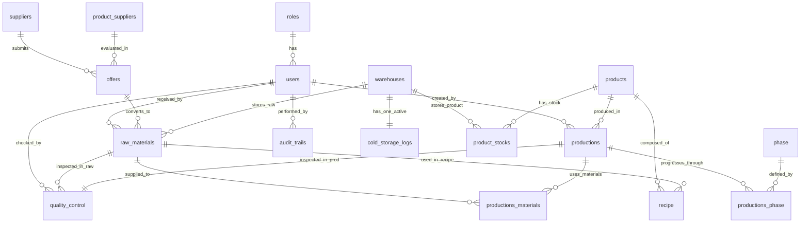

# Product Requirements Document (PRD)
## Sistem Manajemen Rantai Pasok (Supply Chain Management) Sima Arôme

---

## 1. Pendahuluan & Latar Belakang

Sima Arôme adalah produsen wewangian (aroma) premium yang saat ini masih mengandalkan proses operasional manual dan tidak terintegrasi. Tantangan utama yang dihadapi meliputi:
*   **Proses Quality Control (QC) Terfragmentasi**: Pencatatan inspeksi bahan baku dan barang jadi masih berbasis kertas, menyulitkan analisis historis kualitas.
*   **Ketiadaan Traceability (Ketertelusuran)**: Sima Arôme tidak dapat melacak secara akurat bahan baku dari batch mana yang digunakan dalam botol parfum tertentu. Jika terjadi isu kualitas di pasar, proses penarikan produk (product recall) menjadi sangat sulit dan lambat.
*   **Pemilihan Vendor yang Subjektif**: Evaluasi penawaran harga (offers) dari pemasok (suppliers) belum terstandardisasi secara objektif berdasarkan kriteria kunci seperti Harga, Kualitas, dan Lead Time.
*   **Pemantauan Suhu Gudang Pasif**: Bahan baku parfum (essential oils) sensitif terhadap suhu, namun pemantauan cold storage masih dilakukan manual berkala tanpa sistem peringatan dini otomatis.

### Solusi
Sistem Enterprise Data-as-a-Service (DaaS) terintegrasi menggunakan Next.js, Mantine UI, BuildPad DaaS, dan Supabase PostgreSQL untuk mengotomatisasi seluruh alur kerja dari penerimaan bahan baku, kontrol kualitas, penyimpanan gudang, produksi multi-fase, hingga siap dikirim ke pelanggan dengan ketertelusuran penuh (end-to-end traceability).

---

## 2. Objektif & Key Results (OKR)

### Objektif Utama
Membangun sistem SCM digital yang mengotomatisasi alur kerja operasional, memastikan 100% ketertelusuran produksi, menstandardisasi pemilihan vendor secara matematis, serta menyediakan simulasi pemantauan suhu cold storage aktif secara real-time.

### Key Results
1.  **Traceability**: 100% finished goods terasosiasi secara otomatis dengan batch code bahan baku penyusunnya.
2.  **Efisiensi Pengadaan**: Pemilihan penawaran vendor terbaik diproses di bawah 5 detik menggunakan visualisasi metode Analytical Hierarchy Process (AHP).
3.  **Keamanan Cold Storage**: Deteksi anomali suhu cold storage melalui integrasi API cuaca real-time dengan response time alert < 1 detik.
4.  **Adopsi Pengguna**: Mendukung 7 peran aktor (RBAC) dengan visualisasi antarmuka berbasis Mantine UI v8 yang responsif dan intuitif.

---

## 3. Arsitektur Sistem & Tech Stack

Sistem menggunakan **Two-Tier Architecture** yang memisahkan lapisan UI/UX dengan penyimpanan data secara aman melalui API Proxy.

```
┌─────────────────────────────────┐
│          Mantine UI             │  (Frontend React - Next.js App Router)
└────────────────┬────────────────┘
                 │ (Internal API Calls)
                 ▼
┌─────────────────────────────────┐
│      Next.js API Proxy Routes   │  (Mengelola Auth SSR Cookies & Token Bearer)
└────────────────┬────────────────┘
                 │ (HTTPS REST API / MCP Server)
                 ▼
┌─────────────────────────────────┐
│        BuildPad DaaS            │  (REST API Server / Middleware Backend)
└────────────────┬────────────────┘
                 │ (Direct DB Connection / RLS)
                 ▼
┌─────────────────────────────────┐
│     Supabase PostgreSQL         │  (Database, RLS Policies, Triggers & Auditing)
└─────────────────────────────────┘
```

### Rincian Teknologi
1.  **Frontend & App Shell**: Next.js 16 (App Router) + React 19 + TypeScript 5.x.
2.  **UI & Styling**: Mantine UI v8 (menggunakan CSS Custom Properties `--ds-*` untuk token design premium).
3.  **Database**: Supabase PostgreSQL dengan Row Level Security (RLS) diaktifkan secara ketat pada semua tabel.
4.  **Backend DaaS API**: BuildPad DaaS untuk otomatisasi REST API CRUD, agregasi data, logging, dan manajemen izin akses (permissions).
5.  **Fonts**:
    *   Header: **Cormorant Garamond** (Menghadirkan kesan mewah/artisanal aroma)
    *   Subheader: **Montserrat** (Modern dan profesional)
    *   Paragraph/Body: **Inter** (Sangat terbaca/high readability)
6.  **Warna Utama (Mantine Theme)**:
    *   Primary Color: `#1E5B3A` (Deep Forest Green - representasi arôme alami)
    *   Secondary Colors: `#65B32E` (Fresh Olive), `#89C84A` (Lime Green), `#C98A2E` (Rich Amber)
    *   Background Colors: `#FFFFFF` (Clean Base), `#F9F8F4` (Warm Alabaster)
    *   Text Colors: `#2D2D2D` (Primary Text), `#7A7A7A` (Muted), `#CFCFCF` (Disabled), `#E7E7E7` (Border)

---

## 4. Peran Pengguna (RBAC) & Matriks Otorisasi

Sistem mengadopsi struktur Role-Based Access Control (RBAC) yang ketat untuk menjamin keamanan data dan kepatuhan audit.

| Peran (Role) | Deskripsi Tanggung Jawab | Hak Akses Utama (DaaS Permissions) |
| :--- | :--- | :--- |
| **Super Admin** | Mengelola seluruh akun pengguna, menugaskan peran, dan mengonfigurasi master data. | `*` (Full Admin Privileges, CRUD Users & Roles) |
| **Procurement** | Mengelola Pemasok (Suppliers), Katalog Barang (`product_suppliers`), Penawaran (`offers`), dan menjalankan evaluasi keputusan AHP. | `suppliers.*`, `offers.*`, `product_suppliers.read` |
| **Quality Controller** | Melakukan inspeksi kualitas bahan baku masuk (`raw_materials`) dan hasil produksi jadi (`productions`). | `quality_control.*`, `raw_materials.update_status`, `productions.read` |
| **Warehouse Staff** | Mengelola gudang (`warehouses`), melacak stok (`product_stocks`), menerima bahan baku (`raw_materials`), dan memantau suhu cold storage. | `warehouses.*`, `cold_storage_logs.*`, `raw_materials.create`, `product_stocks.*` |
| **Production Team** | Merencanakan produksi (`productions`), mencatat penggunaan bahan baku (`productions_materials`), dan melakukan update status fase produksi (`productions_phase`). | `productions.*`, `productions_phase.*`, `recipe.read` |
| **Supervisor** | Mengawasi kelancaran alur produksi, menyetujui transisi fase, dan melihat traceability log. | `*.read`, `productions_phase.update`, `quality_control.read` |
| **Manager** | Melihat dashboard analitik komprehensif, performa gudang, laporan AHP vendor terbaik, dan laporan audit trails. | `*.read`, `audit_trails.read` |

---

## 5. Rincian Modul Sistem

### Modul 1: Auth & User Management
*   **Registrasi & Manajemen Pengguna**: Halaman khusus bagi Super Admin untuk membuat, memperbarui, dan menghapus akun pengguna (CRUD).
*   **Manajemen Peran**: Manajemen relasi pengguna dengan tabel `roles`.
*   **Security Boundary**: Setiap route frontend dilindungi oleh middleware Next.js. Setiap API Route memvalidasi JWT token yang dikirim melalui auth-cookie untuk mencegah eskalasi hak akses.

### Modul 2: Bahan Baku & Hubungan Pemasok (Procurement & Raw Materials)
*   **Katalog Suppliers**: Pendaftaran pemasok parfum dengan tanda "Favorite" (boolean).
*   **Offers Registry**: Pendaftaran penawaran harga yang mencakup tiga parameter evaluasi kuantitatif:
    1.  `price` (Harga penawaran - rupiah)
    2.  `quality` (Skala kualitas 1-100)
    3.  `lead_time` (Waktu pengiriman dalam hari)
*   **Penerimaan Bahan Baku**: Form input bagi Warehouse Staff untuk mencatat penerimaan bahan baku (`raw_materials`) yang ditugaskan dari penawaran terpilih (`offers`), menghasilkan `batch_code` unik secara otomatis dengan status awal `PENDING_QC`.

### Modul 3: Manajemen Gudang & Pemantauan Stok (Warehouse & Inventory)
*   **Daftar Gudang**: Manajemen lokasi penyimpanan bahan baku maupun produk jadi.
*   **Pemantauan Stok Real-time**: Visualisasi stok bahan baku (`raw_materials` terfilter `QC_ACCEPTED`) dan stok barang jadi (`product_stocks`).
*   **Dashboard Cold Storage**: UI pemantauan khusus cold storage dengan simulasi live data IoT.

### Modul 4: Kontrol Kualitas (Quality Control - QC)
*   **Raw Material QC**: Quality Controller melakukan inspeksi fisik bahan baku berstatus `PENDING_QC`. Status akan diperbarui menjadi `QC_ACCEPTED` (dapat digunakan untuk produksi) atau `QC_REJECTED` (dikembalikan/dibuang).
*   **Product QC**: Quality Controller memvalidasi hasil produksi yang telah selesai. Jika lulus, status berubah menjadi `PASSED` dan stok barang jadi bertambah di `product_stocks`. Jika gagal, berstatus `FAILED` untuk proses investigasi.

### Modul 5: Manajemen Produksi & Traceability (Production)
*   **Master Produk & Resep**: Definisi produk akhir (`products`) beserta resep formula (`recipe`) yang merinci kebutuhan bahan baku (`raw_materials`) per unit produk.
*   **Production Orders**: Perencanaan batch produksi baru dengan status awal `SCHEDULED`, penetapan `lot_number` unik saat produksi dimulai.
*   **Traceability Log Engine**: Pemetaan visual keterkaitan resep produksi, lot number produk jadi, dan batch code bahan baku yang digunakan.

---

## 6. Fitur Unggulan (3 Unique Value Propositions)

### UVP 1: Procurement Decision Support System (DSS) dengan Metode AHP

Sistem menyediakan antarmuka evaluasi vendor otomatis. Saat Procurement memilih jenis bahan baku, sistem memuat semua penawaran (`offers`) terkait dan menghitung prioritas terbaik menggunakan metode **Analytical Hierarchy Process (AHP)** secara real-time.

#### Skema Perhitungan Kuantitatif AHP
Pengguna menentukan bobot kepentingan antar kriteria (Price, Quality, Lead Time) melalui matriks perbandingan berpasangan (Pairwise Comparison Matrix) $A_{3 \times 3}$:

$$A = \begin{pmatrix} 1 & a_{12} & a_{13} \\ a_{21} & 1 & a_{23} \\ a_{31} & a_{32} & 1 \end{pmatrix}$$

Di mana $a_{ji} = 1 / a_{ij}$.
1.  **Normalisasi Matriks**: Menghitung jumlah kolom, lalu membagi setiap elemen dengan jumlah kolomnya.
2.  **Menghitung Bobot Kriteria (Eigenvector)**: Rata-rata baris dari matriks yang dinormalisasi menghasilkan bobot kriteria:
    *   Bobot Harga ($W_P$)
    *   Bobot Kualitas ($W_Q$)
    *   Bobot Lead Time ($W_L$)
3.  **Uji Konsistensi**: Menghitung *Consistency Index* (CI) dan *Consistency Ratio* (CR) untuk memastikan penilaian logis (CR < 0.1). Jika CR ≥ 0.1, sistem meminta procurement menyesuaikan matriks perbandingan berpasangan.
4.  **Normalisasi Nilai Alternatif (Penawaran Pemasok)**:
    *   *Price* (Cost - makin rendah makin baik): $S_{Price, i} = \frac{\min(\text{Price})}{\text{Price}_i}$
    *   *Quality* (Benefit - makin tinggi makin baik): $S_{Quality, i} = \frac{\text{Quality}_i}{\max(\text{Quality})}$
    *   *Lead Time* (Cost - makin cepat makin baik): $S_{LeadTime, i} = \frac{\min(\text{Lead Time})}{\text{LeadTime}_i}$
5.  **Perhitungan Skor Akhir**:
    $$\text{Score}_i = (W_P \times S_{Price, i}) + (W_Q \times S_{Quality, i}) + (W_L \times S_{LeadTime, i})$$

#### Visualisasi UI
Tabel interaktif dengan highlight warna hijau muda pada baris pemasok yang direkomendasikan secara otomatis oleh kalkulasi AHP, dilengkapi dengan grafik radar (radar chart) perbandingan nilai kriteria pemasok.

---

### UVP 2: End-to-End Production Traceability Engine

Pelacakan rantai pasok dari raw material hingga menjadi produk jadi dikelola melalui alur terintegrasi visual.

#### Alur Pelacakan (Traceability Flow)
```
[Penerimaan Bahan Baku] ──► [QC Raw Material (ACCEPTED)] ──► [Penyimpanan Gudang]
                                                                     │
[Produk Jadi (Lot Number)] ◄── [QC Product (PASSED)] ◄── [Fase Produksi (Compounding -> Bottling)]
```

#### Visualisasi Pelacakan (Visual Stepper & Genealogy Tree)
1.  **Genealogy Tree (Pohon Silsilah)**: Saat pengguna memasukkan `lot_number` produk akhir pada modul pencarian, sistem memanggil relasi:
    $$\text{Productions} \rightarrow \text{Productions Materials} \rightarrow \text{Raw Materials} \rightarrow \text{Offers} \rightarrow \text{Suppliers}$$
    Menghasilkan bagan pohon interaktif yang menampilkan asal-usul bahan baku pembentuk parfum tersebut (misalnya, *essential oil jasmine* dari Supplier A Batch #JAS-002, dan *alcohol premium* dari Supplier B Batch #ALC-109).
2.  **Phase Tracking Timeline**: Menampilkan status real-time empat fase produksi esensial parfum:
    *   **Fase 1: Compounding** (Pencampuran konsentrat esensial minyak wangi).
    *   **Fase 2: Maceration** (Proses penuaan/pematangan aroma dalam pelarut).
    *   **Fase 3: Filtering** (Penyaringan partikel pengotor).
    *   **Fase 4: Bottling** (Pengemasan ke dalam botol akhir).
    Setiap fase mencatat: `Waktu Mulai`, `Operator`, `Catatan Suhu/Kondisi`, dan `Status` (PENDING, IN_PROGRESS, COMPLETED).

---

### UVP 3: IoT Cold Storage Temperature Simulation (Live Weather Logic)

Menghadirkan pemantauan suhu cold storage yang presisi tanpa memerlukan perangkat keras fisik dengan memanfaatkan integrasi data cuaca real-time yang disesuaikan secara matematis.

#### Mekanisme Logika IoT Simulasi
1.  Sistem mendefinisikan koordinat geografis atau lokasi kota untuk setiap gudang cold storage (misalnya, Jakarta, latitude: -6.2088, longitude: 106.8456).
2.  Saat dipanggil, sistem melakukan pemanggilan API gratis pihak ketiga (seperti **Open-Meteo API** yang tidak memerlukan API key) untuk mendapatkan suhu udara real-time di lokasi tersebut ($T_{\text{outdoor}}$).
3.  **Rumus Suhu Cold Storage Internal**:
    $$T_{\text{cold\_storage}} = T_{\text{outdoor}} - 40^\circ\text{C}$$
    *Contoh*: Jika suhu luar Jakarta saat ini adalah $32^\circ\text{C}$, maka suhu simulasi cold storage adalah $32 - 40 = -8^\circ\text{C}$ (ideal untuk pembekuan/preservasi essential oil).
4.  **Batas Suhu Aman (Threshold)**: Jika $T_{\text{cold\_storage}} > 5^\circ\text{C}$, sistem mendeteksi kondisi tidak aman (misalnya suhu luar ruangan melonjak ekstrim menjadi $46^\circ\text{C}$ sehingga suhu gudang menjadi $6^\circ\text{C}$).
5.  **Pemicu Alarm (Alert Trigger)**:
    *   Sistem mengubah status `alert_triggered = true` pada data log `cold_storage_logs` yang disimpan.
    *   Di halaman dashboard, widget gudang terkait akan berkedip merah terang dan memicu suara alarm peringatan di browser, serta mencatat entri otomatis pada `audit_trails`.

---

## 7. Skema Database Relasional (SQL & DaaS Schema)

Skema database berikut adalah landasan mutlak untuk pengkodean migrasi. Semua kolom dan relasi harus diimplementasikan tepat sesuai dengan struktur di bawah ini.



### PostgreSQL DDL Script (Supabase-Compatible)

Berikut adalah DDL SQL lengkap yang wajib dieksekusi di Supabase Database Editor pada Phase 1.

```sql
-- Enable UUID extension
CREATE EXTENSION IF NOT EXISTS "uuid-ossp";

-- Table: roles
CREATE TABLE roles (
    id UUID PRIMARY KEY DEFAULT gen_random_uuid(),
    name VARCHAR(255) NOT NULL UNIQUE,
    description TEXT NOT NULL
);

-- Table: users
CREATE TABLE users (
    id UUID PRIMARY KEY DEFAULT gen_random_uuid(),
    role_id UUID NOT NULL REFERENCES roles(id) ON DELETE RESTRICT,
    email VARCHAR(255) NOT NULL UNIQUE,
    fullname VARCHAR(50) NOT NULL,
    phone_number VARCHAR(10) NOT NULL,
    gender INTEGER NOT NULL, -- 1: Laki-laki, 2: Perempuan
    password_hash VARCHAR(255) NOT NULL,
    created_at TIMESTAMP NOT NULL DEFAULT CURRENT_TIMESTAMP,
    updated_at TIMESTAMP
);

-- Table: suppliers
CREATE TABLE suppliers (
    id UUID PRIMARY KEY DEFAULT gen_random_uuid(),
    name VARCHAR(255) NOT NULL,
    favorite BOOLEAN NOT NULL DEFAULT FALSE,
    phone_number VARCHAR(255) NOT NULL,
    address VARCHAR(255) NOT NULL,
    created_at TIMESTAMP NOT NULL DEFAULT CURRENT_TIMESTAMP
);

-- Table: product_suppliers
CREATE TABLE product_suppliers (
    id UUID PRIMARY KEY DEFAULT gen_random_uuid(),
    name VARCHAR(255) NOT NULL,
    price BIGINT NOT NULL,
    unit VARCHAR(255) NOT NULL,
    created_at TIMESTAMP NOT NULL DEFAULT CURRENT_TIMESTAMP
);

-- Table: offers
CREATE TABLE offers (
    id UUID PRIMARY KEY DEFAULT gen_random_uuid(),
    supplier_id UUID NOT NULL REFERENCES suppliers(id) ON DELETE CASCADE,
    product_supplier_id UUID NOT NULL REFERENCES product_suppliers(id) ON DELETE CASCADE,
    price BIGINT NOT NULL,
    quality BIGINT NOT NULL, -- Skala 1-100
    lead_time BIGINT NOT NULL -- Dalam satuan hari
);

-- Table: cold_storage_logs (di-declare dahulu agar warehouses dapat me-reference log_id)
CREATE TABLE cold_storage_logs (
    id UUID PRIMARY KEY DEFAULT gen_random_uuid(),
    zone_id VARCHAR(50) NOT NULL,
    temperature DECIMAL(5,2) NOT NULL,
    alert_triggered BOOLEAN DEFAULT FALSE,
    recorded_at TIMESTAMP DEFAULT CURRENT_TIMESTAMP
);

-- Table: warehouses
CREATE TABLE warehouses (
    id UUID PRIMARY KEY DEFAULT gen_random_uuid(),
    log_id UUID NOT NULL REFERENCES cold_storage_logs(id) ON DELETE SET NULL,
    name VARCHAR(50) NOT NULL,
    location BIGINT NOT NULL, -- Koordinat atau kode area lokasi
    created_at TIMESTAMP NOT NULL DEFAULT CURRENT_TIMESTAMP
);

-- Menambahkan Foreign Key Constraint timbal balik 1-to-1 dari cold_storage_logs ke warehouses (jika diperlukan)
-- Namun sesuai spesifikasi DBML: Table cold_storage_logs { id UUID [pk, ref: - warehouses.log_id] }

-- Table: raw_materials
CREATE TABLE raw_materials (
    id UUID PRIMARY KEY DEFAULT gen_random_uuid(),
    warehouse_id UUID NOT NULL REFERENCES warehouses(id) ON DELETE RESTRICT,
    offer_id UUID NOT NULL REFERENCES offers(id) ON DELETE RESTRICT,
    batch_code VARCHAR(100) NOT NULL UNIQUE,
    material_name VARCHAR(100) NOT NULL,
    status VARCHAR(50) NOT NULL CHECK (status IN ('PENDING_QC', 'QC_ACCEPTED', 'QC_REJECTED', 'IN_PRODUCTION')),
    total_price BIGINT NOT NULL,
    weight_kg DECIMAL(10,2) NOT NULL,
    received_by UUID NOT NULL REFERENCES users(id) ON DELETE RESTRICT,
    received_at TIMESTAMP DEFAULT CURRENT_TIMESTAMP,
    updated_at TIMESTAMP DEFAULT CURRENT_TIMESTAMP
);

-- Table: products
CREATE TABLE products (
    id UUID PRIMARY KEY DEFAULT gen_random_uuid(),
    type VARCHAR(255) NOT NULL,
    categories VARCHAR(255) NOT NULL,
    price BIGINT NOT NULL
);

-- Table: product_stocks
CREATE TABLE product_stocks (
    id UUID PRIMARY KEY DEFAULT gen_random_uuid(),
    product_id UUID NOT NULL REFERENCES products(id) ON DELETE CASCADE,
    warehouse_id UUID NOT NULL REFERENCES warehouses(id) ON DELETE CASCADE,
    amount BIGINT NOT NULL DEFAULT 0
);

-- Table: productions
CREATE TABLE productions (
    id UUID PRIMARY KEY DEFAULT gen_random_uuid(),
    products_id UUID NOT NULL REFERENCES products(id) ON DELETE RESTRICT,
    scheduled_date DATE NOT NULL,
    planned_quantity BIGINT NOT NULL,
    actual_quantity BIGINT NOT NULL DEFAULT 0,
    start_date DATE NOT NULL,
    end_date DATE NOT NULL,
    status VARCHAR(20) DEFAULT 'SCHEDULED' CHECK (status IN ('SCHEDULED', 'IN_PROGRESS', 'COMPLETED', 'CANCELLED')),
    lot_number VARCHAR(100) UNIQUE,
    created_by UUID REFERENCES users(id) ON DELETE SET NULL,
    created_at TIMESTAMP DEFAULT CURRENT_TIMESTAMP
);

-- Table: recipe
CREATE TABLE recipe (
    id UUID PRIMARY KEY DEFAULT gen_random_uuid(),
    products_id UUID NOT NULL REFERENCES products(id) ON DELETE CASCADE,
    raw_material_id UUID NOT NULL REFERENCES raw_materials(id) ON DELETE CASCADE,
    quantity INTEGER NOT NULL,
    created_at TIMESTAMP NOT NULL DEFAULT CURRENT_TIMESTAMP,
    updated_at TIMESTAMP NOT NULL DEFAULT CURRENT_TIMESTAMP
);

-- Table: phase
CREATE TABLE phase (
    id UUID PRIMARY KEY DEFAULT gen_random_uuid(),
    name VARCHAR(255) NOT NULL UNIQUE, -- Compounding, Maceration, Filtering, Bottling
    description VARCHAR(255) NOT NULL
);

-- Table: productions_phase
CREATE TABLE productions_phase (
    id UUID PRIMARY KEY DEFAULT gen_random_uuid(),
    production_id UUID NOT NULL REFERENCES productions(id) ON DELETE CASCADE,
    phase_id UUID NOT NULL REFERENCES phase(id) ON DELETE RESTRICT,
    status VARCHAR(20) DEFAULT 'PENDING' CHECK (status IN ('PENDING', 'IN_PROGRESS', 'COMPLETED')),
    note TEXT NOT NULL
);

-- Table: quality_control
CREATE TABLE quality_control (
    id UUID PRIMARY KEY DEFAULT gen_random_uuid(),
    raw_material_id UUID UNIQUE NOT NULL REFERENCES raw_materials(id) ON DELETE RESTRICT,
    production_id UUID UNIQUE NOT NULL REFERENCES productions(id) ON DELETE RESTRICT,
    checked_by UUID NOT NULL REFERENCES users(id) ON DELETE RESTRICT,
    qc_status VARCHAR(50) NOT NULL CHECK (qc_status IN ('PASSED', 'FAILED', 'PENDING')),
    qc_notes TEXT NOT NULL,
    created_at TIMESTAMP NOT NULL DEFAULT CURRENT_TIMESTAMP
);

-- Table: productions_materials
CREATE TABLE productions_materials (
    id UUID PRIMARY KEY DEFAULT gen_random_uuid(),
    raw_material_id UUID NOT NULL REFERENCES raw_materials(id) ON DELETE RESTRICT,
    production_id UUID NOT NULL REFERENCES productions(id) ON DELETE CASCADE,
    quantity_used BIGINT NOT NULL
);

-- Table: audit_trails
CREATE TABLE audit_trails (
    id UUID PRIMARY KEY DEFAULT gen_random_uuid(),
    user_id UUID REFERENCES users(id) ON DELETE SET NULL,
    action VARCHAR(50) NOT NULL,
    target_table VARCHAR(50) NOT NULL,
    record_id VARCHAR(255) NOT NULL, -- Diubah ke VARCHAR untuk menampung UUID
    old_data TEXT,
    new_data TEXT,
    timestamp TIMESTAMP DEFAULT CURRENT_TIMESTAMP
);
```

---

## 8. Panduan Desain Antarmuka (UI/UX Guidelines)

Semua halaman antarmuka wajib dirancang sejalan dengan identitas visual Sima Arôme yang premium, membumi, dan bersih.

```
Font Header   : Cormorant Garamond (Elegansi Klasik)
Font Subheader: Montserrat (Modern Bold)
Font Body     : Inter (Clean Neutral)
```

### Konfigurasi Tema Mantine (Mantine Theme Configuration)

```typescript
import { createTheme, MantineColorsTuple } from '@mantine/core';

const primaryForestGreen: MantineColorsTuple = [
  '#ebf7f0',
  '#d6ede0',
  '#aadbbf',
  '#7bc799',
  '#53b679',
  '#3da764',
  '#309f58',
  '#238b4a',
  '#1e5b3a', // Primary #1E5B3A
  '#13472a',
];

export const theme = createTheme({
  fontFamily: 'Inter, sans-serif',
  fontFamilyMonospace: 'Courier, monospace',
  headings: {
    fontFamily: 'Cormorant Garamond, serif',
    sizes: {
      h1: { fontSize: '2.5rem', fontWeight: '700', lineHeight: '1.2' },
      h2: { fontSize: '2.0rem', fontFamily: 'Montserrat, sans-serif', fontWeight: '600' },
      h3: { fontSize: '1.5rem', fontFamily: 'Montserrat, sans-serif', fontWeight: '500' },
    },
  },
  colors: {
    brand: primaryForestGreen,
    accentAmber: [
      '#fdf6e7', '#fbeacf', '#f7d59f', '#f2bf6b', '#eda940',
      '#c98a2e', // Secondary #C98A2E
      '#a26c21', '#7b5016', '#54350d', '#331d04'
    ],
    accentLime: [
      '#f4fbe9', '#e6f7d0', '#cdeea2', '#b2e570', '#9ad946',
      '#89c84a', // Secondary #89C84A
      '#569022', '#3a6616', '#203e0b', '#0a1701'
    ]
  },
  primaryColor: 'brand',
  primaryShade: 8,
  defaultRadius: 'md',
  components: {
    Button: {
      defaultProps: {
        color: 'brand',
        radius: 'md',
      },
    },
    Card: {
      defaultProps: {
        padding: 'xl',
        radius: 'lg',
        bg: '#FFFFFF',
      },
    },
  },
});
```

---

## 9. Struktur Folder Project & Desain API Routes

Penyusunan proyek mengikuti standard Next.js App Router dengan pemisahan domain modul yang jelas.

```
src/
├── app/
│   ├── layout.tsx                   # Setup Provider (Mantine, DaaSProvider)
│   ├── page.tsx                     # Landing Page & Login Redirect
│   ├── dashboard/                   # Main Layout & Sidebar
│   │   ├── page.tsx                 # Dashboard Analitik Ringkas
│   │   ├── procurement/             # Modul 2: AHP Evaluator & Penawaran
│   │   │   └── page.tsx
│   │   ├── warehouse/               # Modul 3: Pemantauan Stok & IoT Live Cold Storage
│   │   │   └── page.tsx
│   │   ├── qc/                      # Modul 4: QC Raw & QC Finished Goods
│   │   │   └── page.tsx
│   │   └── production/              # Modul 5: Production Stepper & Traceability
│   │       └── page.tsx
│   └── api/
│       ├── auth/                    # Next.js API Routes Proxy Auth (JWT cookie)
│       │   ├── login/route.ts
│       │   └── logout/route.ts
│       ├── ahp/                     # Perhitungan matematis AHP Server-Side
│       │   └── route.ts
│       └── iot/                     # Simulasi suhu dengan Weather API
│           └── route.ts
├── components/                      # Custom components penunjang (Buildpad-First)
│   ├── TraceabilityTree.tsx         # Bagan silsilah lot produksi
│   ├── TemperatureGauge.tsx         # Tampilan thermometer IoT
│   └── AHPRadarChart.tsx            # Grafik evaluasi penawaran
├── hooks/                           # Custom React Hooks
│   ├── useIoTWeather.ts
│   └── usePermissions.ts
└── lib/
    ├── ahpEngine.ts                 # Algoritma normalisasi & eigenvector
    └── daasClient.ts                # Client terbungkus untuk fetch data DaaS
```

---

## 10. Strategi Pengujian (Testing Strategy)

Pengujian dibagi menjadi tiga tingkat keandalan untuk memastikan kepatuhan alur kerja dan keamanan data.

### 1. Unit Testing (Vitest)
*   **AHP Calculation Engine**: Menguji presisi normalisasi matriks, perhitungan eigenvector, dan kalkulasi Consistency Ratio (CR) dengan data sampel terprediksi.
*   **IoT Temperature Logic**: Memastikan pemotongan temperatur $T_{\text{outdoor}} - 40^\circ\text{C}$ berjalan akurat dan flag alert berstatus `true` saat suhu melampaui $5^\circ\text{C}$.

### 2. Integration Testing (Next.js API Routes Tests)
*   **Auth Proxy Interceptor**: Menguji pemblokiran request tanpa token valid dan penerusan token valid ke DaaS backend.
*   **Traceability Tree API**: Memastikan response API mengembalikan struktur data lengkap berantai dari `productions` ke `suppliers`.

### 3. End-to-End Testing (Playwright)
*   **Flow 1: Pengadaan AHP & QC**: Procurement membuat penawaran -> Menjalankan kalkulasi AHP -> Memilih pemenang -> Penerimaan bahan baku oleh Warehouse -> Quality Controller menyetujui bahan baku -> Status berubah menjadi `QC_ACCEPTED`.
*   **Flow 2: Produksi multi-fase & Traceability**: Mengambil resep produk -> Memulai order produksi -> Transisi fase dari Compounding hingga Bottling -> Mengajukan QC produk -> Produk berstatus `PASSED` -> Melakukan pencarian lot_number di visual pedigree tree dan memverifikasi keterkaitan bahan bakunya.

---

## 11. Panduan Eksekusi Lengkap (Execution Roadmap)

Pekerjaan pengembangan wajib dilakukan secara bertahap menggunakan model **Phased Development** BuildPad DaaS. Pindah ke fase berikutnya hanya setelah seluruh Exit Gates fase sebelumnya teruji dan tercentang hijau.

### PHASE 0: FOUNDATION (Kerangka Awal & Penyiapan Proyek)
*   **Deskripsi**: Bootstrapping Next.js, inisialisasi Mantine Theme, konfigurasi ESLint/Prettier, dan instalasi library dasar UI.
*   **Langkah Eksekusi**:
    1.  Jalankan bootstrap BuildPad UI:
        ```bash
        npx @buildpad/cli@latest bootstrap
        ```
    2.  Instal komponen-komponen UI BuildPad esensial:
        ```bash
        npx @buildpad/cli@latest add input selection datetime collection-form collection-list layout
        ```
    3.  Konfigurasi file `.env.local` dengan kredensial Supabase dan DaaS.
*   **Exit Gates**:
    - [ ] Aplikasi Next.js dapat dijalankan lokal (`npm run dev`) tanpa error kompilasi.
    - [ ] Teks dengan font *Cormorant Garamond* dan *Montserrat* ter-render sempurna sesuai token CSS.

### PHASE 1: DATA FOUNDATION (Migrasi Database & API Proxy)
*   **Deskripsi**: Membuat seluruh tabel database PostgreSQL di Supabase, mengaktifkan RLS, serta membuat schema JSON di DaaS.
*   **Langkah Eksekusi**:
    1.  Buat berkas migrasi database Supabase dan masukkan script DDL dari Bab 7.
    2.  Definisikan koleksi di BuildPad DaaS menggunakan CLI atau panel admin.
    3.  Terapkan RLS policies standar: melarang pembacaan anonim pada semua tabel, batasi penulisan hanya untuk aktor terautentikasi sesuai perannya.
    4.  Bangun Next.js API Routes Proxy di `/api/auth` untuk memediasi otentikasi aman.
*   **Exit Gates**:
    - [ ] Seluruh tabel terbuat dengan relasi foreign key yang kokoh di PostgreSQL.
    - [ ] Unit test API auth proxy mengembalikan status sukses (200) dengan set-cookie JWT HttpOnly.

### PHASE 2: CORE UI (Halaman Utama & Formulir Terintegrasi)
*   **Deskripsi**: Membuat halaman dashboard utama beserta halaman CRUD esensial untuk Suppliers, Warehouses, Products, dan Users.
*   **Langkah Eksekusi**:
    1.  Terapkan tata letak (App Layout) bersisi navigasi dinamis yang membatasi menu berdasarkan hak akses pengguna.
    2.  Buat tabel daftar data (Collection List) dengan fitur filter dan pagination responsif menggunakan komponen `VTable` BuildPad.
    3.  Susun formulir pengisian data dinamis (Collection Form) untuk menambahkan supplier, gudang baru, dan mendaftarkan pengguna baru oleh Super Admin.
*   **Exit Gates**:
    - [ ] Halaman CRUD basic (Pemasok, Gudang, Akun) berfungsi penuh tanpa bug input.
    - [ ] Layout sidebar menyembunyikan menu otomatis sesuai peran yang disimulasikan saat login.

### PHASE 3: BUSINESS LOGIC & 3 UVP IMPLEMENTATION (Logika Inti Sistem)
*   **Deskripsi**: Mengimplementasikan algoritma AHP, alur pelacakan fase produksi, dan simulasi sensor suhu IoT.
*   **Langkah Eksekusi**:
    1.  **AHP Engine**: Implementasikan `lib/ahpEngine.ts` untuk normalisasi matriks, kalkulasi bobot kriteria, dan ranking alternatif. Integrasikan ke dalam antarmuka Procurement.
    2.  **IoT Engine**: Implementasikan Next.js API `/api/iot` yang memanggil API Open-Meteo untuk lokasi gudang, kurangi $40^\circ\text{C}$, dan simpan log cold storage secara berkala ke database. Tambahkan alarm UI visual pada dashboard.
    3.  **Traceability Engine**: Bangun query rekursif di backend/API proxy untuk memetakan pedigree rantai pasok dan pasang visual timeline fase produksi parfum.
*   **Exit Gates**:
    - [ ] Nilai AHP kalkulator terbukti konsisten dengan evaluasi matriks manual (CR < 0.1).
    - [ ] Perubahan suhu di atas $5^\circ\text{C}$ pada dashboard gudang memicu warna merah berkedip dan status alert aktif.
    - [ ] Pencarian batch lot_number mengembalikan pohon silsilah lengkap bahan baku yang valid.

### PHASE 4: QUALITY CONTROL & RELATION INTEGRATION (Integrasi Relasional & QC)
*   **Deskripsi**: Menghubungkan proses kendali mutu (QC) bahan baku dan produk jadi dengan modul inventori/gudang.
*   **Langkah Eksekusi**:
    1.  Implementasikan alur kerja QC: bahan baku diterima (`PENDING_QC`) -> diinspeksi QC -> status berubah menjadi `QC_ACCEPTED` (stok bertambah) atau `QC_REJECTED`.
    2.  Implementasikan alur kerja Produksi: status order selesai -> memicu form Product QC -> jika lulus (`PASSED`), secara otomatis hitung pengurangan bahan baku dari `recipe` di gudang bersangkutan dan tambahkan stok jadi di `product_stocks`.
*   **Exit Gates**:
    - [ ] Pengurangan bahan baku dari resep terpotong akurat pada stok gudang saat status produksi selesai.
    - [ ] Mutasi stok terdokumentasi rapi pada tabel audit trail.

### PHASE 5: POLISH & AUDIT PRODUCTION (Penyempurnaan Akhir & Audit Trails)
*   **Deskripsi**: Implementasi penuh pencatatan audit trails untuk setiap transaksi vital, optimasi performa Core Web Vitals, dan E2E Testing.
*   **Langkah Eksekusi**:
    1.  Aktifkan trigger log audit trails pada PostgreSQL untuk mendeteksi perubahan data sensitif pada tabel penawaran, gudang, resep, dan stok.
    2.  Optimalkan performa render visual dengan caching, lazy loading komponen chart, dan optimasi query PostgreSQL.
    3.  Lakukan pengetesan menyeluruh menggunakan Playwright E2E.
*   **Exit Gates**:
    - [ ] Seluruh skenario pengujian Playwright E2E lulus uji 100%.
    - [ ] Aplikasi lulus audit keandalan data dengan catatan log perubahan (old/new data) tercatat rapi di tabel `audit_trails`.
    - [ ] Dokumentasi akhir sistem lengkap dan dideploy ke AWS Amplify.
